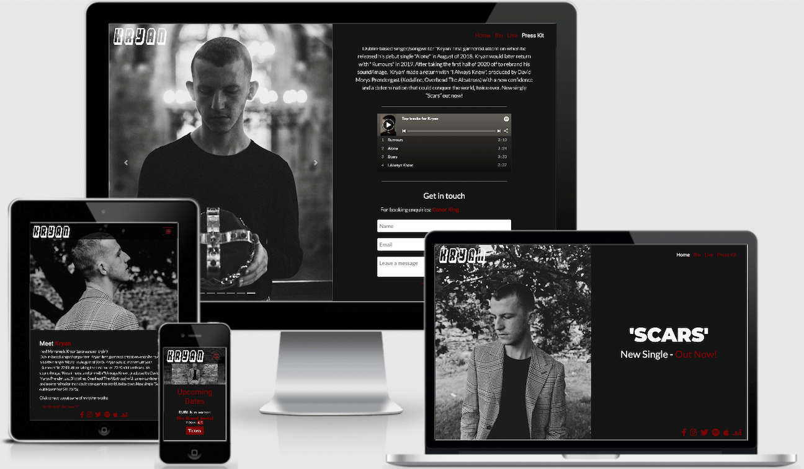

# Kryan Live
## Table of contents
1. [Introduction](#Introduction)
2. [UX](#UX)
    1. [Ideal User Demographic](#Ideal-User-Demographic)
    2. [User Stories](#User-Stories)
    3. [Design](#Design)
    4. [Wireframes](#Wireframes)
3. [Features](#Features)
    1. [Design Features](#Design-Features)
    2. [Existing Features](#Existing-Features)
    3. [Features to Implement in the future](#Features-to-Implement-in-the-future)
4. [Bugs](#Bugs)
5. [Technologies Used](#Technologies-Used)
     1. [Main Languages Used](#Main-Languages-Used)
     2. [Additional Languages Used](#Additional-Languages-Used)
     3. [Frameworks, Libraries & Programs Used](#Frameworks,-Libraries-&-Programs-Used)
6. [Testing](#Testing)
     1. [Testing User Stories](#Testing-User-Stories)
7. [Deployment](#Deployment)
     1. [Deploying on GitHub Pages](#Deploying-on-GitHub-Pages)
     2. [Forking the Repository](#Forking-the-Repository)
     3. [Creating a Clone](#Creating-a-Clone)
8. [Credits](#Credits)
     1. [Content](#Content)
     2. [Media](#Media)
     3. [Code](#Code)
9. [Acknowledgements](#Acknowledgements)
***

## Introduction

This comprehensive website was designed for the artist known as Kryan. The focus of the site is to create an online presence allowing members of the media, as well as new and current fans, to find out relevant information and to get to know Kryan. 



[View the live project here](https://rebeccatraceyt.github.io/KryanLive/)

Kryan is a Dublin based singer/songwriter multi-instrumentalist, focusing mainly on pop music. With multiple single releases, Kryan has garnered attention across many media outlets since 2018. The purpose of the site was to highlight these achievements and to provide an avenue for communication with media outlets and fans alike.

**Client goals for the website:**
- Develop an online presence for Kryan
- Provide an easily navigable website for users to find relevant information:
     - New releases
     - Biographical information
- Provide a channel of communication for media enquires (Electronic Press Kit with contact information)
- Provide a channel of communication for new and current fans (Social Links - easily accessible throughout the site)

**User goals for the website:**
- Retrieve desired information:
     - Biographical information
     - New releases
     - Upcoming live events
     - Contact information (PR and social enquires)

[Back to top ⇧](#Kryan-Live)

## UX 

### Ideal User Demographic
#### The ideal user of this website is:
- Potential fans
- Current fans
- Media outlets
- Event bookers

### User Stories
#### New/Potential Fans Goals:
1. As a new fan, I want to easily navigate through the website to find the relevant content, effortlessly.
2. As a new fan, I want to learn more about the artist's background in order to better understand their music and the meaning behind it.
3. As a new fan, I want to easily navigate to the artist's social links in order to keep up with the latest news and releases.
4. As a new fan, I want to easily find links to the hosted music platform of my choice, in order to listen to Kryan.
5. As a new fan, I want to be able to watch an embedded video to be able to get a snapshot of Kryan performing.

#### Current Fans Goals:
1. As a current fan, I want to navigate to information about upcoming live events in order to securely order tickets.
2. As a current fan, I want to find out about new and upcoming releases to be able to pre-save or listen to the music.
3. As a current fan, I want to easily navigate to the artist's music page on my desired music platform, e.g. Spotify.

#### Potential Bookers Goals:
1. As a potential booker, I want to easily navigate to the artist's Electronic Press Kit to source relevant information:
     - Media coverage
     - Biographical information
     - Sample music
     - PR contact details

#### Media Enquirer Goals:
1. A a media enquirer, I want to easily navigate to the artist's Electronic Press Kit to source relevant information:
     - Media coverage
     - Biographic information
     - Sample music
     - PR contact details
2. As a media enquirer, I want to easily find materials that could be useful for media coverage pieces:
     - New music links
     - Social links

### Design
#### Colour Scheme
The main colours used throughout the website are a mixture of Black and White, with Red accents.

The chosen colour scheme is a reflection of the artist's look and feel.

#### Typography
The pairing of the fonts [Roboto](https://fonts.google.com/specimen/Roboto) and [Lato](https://fonts.google.com/specimen/Lato) is used throughout the website with Sans Serif as the fallback font in case of import failure. 

For features that needed to be highlighted, such as the featured single on the Homepage, the font [Montserrat](https://fonts.google.com/specimen/Montserrat) was used, with Sans Serif as the fallback. This was in order to create a consistency with the digital artwork of the single's release.

#### Imagery
The selected imagery is modern and cohesively aesthetic, reflecting the artist's look and feel. 

The imagery is catching and visually represents the theme of the website.

All imagery provides alternative text to be used in the event that the element cannot be rendered. The template used to provide alt text for background images can be found [here](http://www.davidmacd.com/blog/alternate-text-for-css-background-images.html).

### Wireframes

   - Home Page - [Wireframe](assets/readme-files/home.png "Home Page Wireframe")
   - Bio Page - [Wireframe](assets/readme-files/bio.png "Bio Page Wireframe") 
   - Live Page - [Wireframe](assets/readme-files/live.png "Live Page Wireframe")
   - Electronic Press Kit Page - [Wireframe](assets/readme-files/presskit.png "Electronic Press Kit Page Wireframe")

[Back to top ⇧](#Kryan-Live)

## Features

### Design Features
Each page of the website features a consistent responsive navigational system:
- The **Header** contains a conventionally placed **logo** in the top left of the page (whereby by clicking this will redirect users back to the home page) and **navigation bar** in the top right of the page.
- On larger screens, the **Footer** contains the appropriate **social media icons**, linking users to the main social pages of Kryan. For smaller screens, the footer is hidden and the social icons are instead displayed with the navigation links in the header. This was in order to remove any issues that may arise if the icons are in the way of scrolling on a mobile.
- On smaller screens, the navigation bar collapses into a **toggler** icon whereby clicking it will reveal the navigation and social links.


<dl>
  <dt><a href="index.html" target="_blank">Home Page</a></dt>
  <dd>The Home Page is divided two columns wide on desktops and one column wide on mobile and tablet devices:
     <ul>
          <li><strong>Hero Image</strong> - Occupying 50% of the page width, on the left side, while viewing on a desktop. On mobile and tablet devices, the image becomes stacked at the top of the page, occupying 100% of the page width. The imagery used was specifically chosen as it created a impactful first impression, setting the tone of the website for the user.
          </li>
          <li><strong>Banner Container</strong> - Occupying 50% of the width, on the right side, while viewing on a desktop. On mobile and tablet devices, the container becomes stacked, underneath the <strong>Hero Image</strong>. The purpose of the container is to provide an area in the center to highlight the latest release from the artist. This style was chosen in order to draw the users attention to the information straight away. In this, there is a <strong>call to action</strong> button linking to the external page where users can select their preferred platform to listen to the latest release.
          </li>
     </ul>
  </dd>

  <dt><a href="bio.html" target="_blank">Bio Page</a></dt>
  <dd>The Bio Page is divided similarly to the Home Page in order to maintain consistency. Just like the Home page, the Bio page is two columns wide on desktops and one column wide on mobile and tablet devices:
     <ul>
          <li><strong>Hero Image</strong> - Occupying 50% of the page width, on the left side, while viewing on a desktop. On mobile and tablet devices, the image becomes stacked at the top of the page, occupying 100% of the page width. The imagery used was specifically chosen to visually represent the tonality of the artist's persona.
          </li>
          <li><strong>Banner Container</strong> - Occupying 50% of the width, on the right side, while viewing on a desktop. On mobile and tablet devices, the container becomes stacked, underneath the <strong>Hero Image</strong>. The container provides the biographic information of the artist. It was styled this way in order to draw the users attention to the biography, avoiding information overload in an already text-based area. The information is presented in an accordion menu.
          </li>
     </ul>
  </dd>

  <dt><a href="live.html" target="_blank">Live Page</a></dt>
  <dd>The Live page uses a full page <strong>background image</strong>, providing a uniformed and consistent look for aesthetic purposes. The image is a secondary feature of this page, but still accurately representing the look and feel of the website. 
  </dd>
  <dd> A <strong>container</strong> is centered, overlaying the background image. The purpose of this container is to uniformly provide the necessary information to the user, upcoming events in this case. The container is divided into two, with two columns on a desktop and stacked columns on smaller screens. One column represents the upcoming dates information. Within this colum there are two <strong>call to action</strong> buttons, linking to external websites:
     <ul>
          <li>Event page</li>
          <li>Ticketing platform</li>
     </ul>
     The second column contains an <strong>iFrame</strong> feature of the event's venue location. Providing users with easy access to directions to the venue. This feature is not available on mobile devices as, in tryin to fit the two columns, it would render the text unreadable.

  </dd>

  <dt><a href="epk.html" target="_blank">Electronic Press Kit Page</a></dt>
  <dd> On the desktop, the EPK Page has a half page static background <strong>image carousel</strong> that is fixed and unmoving as the user scrolls through the page. The other half of the pages houses the EPK information in one <strong>container</strong>. The information is separated by a <strong>horizontal ruler</strong> in order to emphasis each piece. On a smaller screen, the page becomes stacked, whereby the images are at the top of the page, but not fixed, followed by the information. 
  </dd>
  <dd>There is a <strong>call to action</strong> button on the page:
     <ul>
          <li>Linking to the external article where the quote is sourced from, in this case Indie Buddy</li>
     </ul>
  </dd>
  <dd>There are two <strong>embedded links</strong> that were chosen to showcase the artist's best releases in both audio and video format:
     <ul>
          <li><strong>Spotify</strong> embedding, showcasing the most played music on Kryan's spotify page</li>
          <li><strong>IGTV</strong> embedding, showcasing his latest music video</li>
     </ul>
  </dd>
  <dd>
     There is a point of contact at the bottom of the Press Kit providing:
     <ul>
          <li>An <strong>mailto</strong> button for users to contact PR representative </li>
          <li>A <strong>contact form</strong>, allowing users to leave a message, by completing the required fields</li>
     </ul>
      
  </dd>
</dl>
 
### Existing Features
- **Header Logo** - Appearing on every page for brand recognition. Clicking the logo will return the users to the home page, as expected.
- **Header Navigation Bar** - Appearing on every page for a consistently easy and intuitive navigable system.
- **Social Icons** - Appearing on every page, the icons are appropriate representations of the Social Media platforms, linking users to Kryan's page on each. On larger screens, the icons appear in the footer. On smallers screens the icons appear in the collapsed toggler funtion.
- **Call To Action buttons** - Appearing on every page, excluding the Bio Page. Maintaining a consistent and uniform design throughout the page. Clicking the buttons will send users to external sites for various purposes:
     - Music platform selection page
     - Articles featuring Kryan
     - External ticket purchasing site
     - Link to events page
     - Mailto action function for contacting PR representative
- **Spotify Embed** - Snapshot of Kryan's Spotify page, showcasing a select number of tracks users can choose to play.
- **IGTV Embed** - iframe element for a video uploaded to Instagram, showcasing a stripped down version of a latest release. This embed was copied straight from Instagram. The developer did not want to alter this text in order to maintain the integrity of the embedding. The only change made was to override the `min-width` value to `min-width: 70% !important;` in order to fixed a problem with the responsiveness of the embed.
- **Google Maps Embed** - iframe embedding of Google maps, showing the location for the event on the Live Page. The map is omitted from small devices in order to ensure the readablity of the page on mobile devices (an issue that the developer struggled with was trying to implement both but still keeping the text at a readable size).
- **Accordion** - An accordion menu on the Bio Page allows user to look through the previous works of the artist. When one accordion is clicked, the others are automatically minimised for UX purposes.
- **Carousel** - A carousel showcasing select images is implemented in the Press Kit page. Using press photos selected by the artist, the carousel highlights their previous events and photoshoots .
- **Contact Form** - A contact form is used in the Press Kit page, in order to provide a point of contact for the user. The form is not validated but there is a `mailto` action above it, providing contact details for the Event Booker of the artist.
- **[Bio Page](bio.html "Bio Page")** - Providing biographic information for the users to get an understanding of who the artist is, and how they have created their music, presented in an accordion menu.
- **[Live Page](live.html "Live Page")** - Providing information on upcoming events. On larger screens, an iframe embed of Google Maps is used to provide the location details of the event. There are also call to action buttons for:
     - The venue site, for further information and directions
     - The ticket purchasing platform for pricing and ordering

- **[Electronic Press Kit Page](epk.html "Electronic Press Kit Page")** - Providing a compressed view of the artist with snapshots of relevant information:
     - Media coverage (featured articles)
     - Sample works - audio and video
     - Contact channels for PR representative

### Features to Implement in the future
- **Merchandise Shop**
     - **Feature** - set up an shop where the artist can sell their merchandise directly to fans online.
     - **Reason for not featuring in this release** - JavaScript needed to implement.
 
 - **[LinkFire](https://www.linkfire.com/) embedding**
     - **Feature** - smartlink embedding platform for music promotion
     - **Reason for not featuring in this release** - Budget not available for services

[Back to top ⇧](#Kryan-Live)

## Bugs

**Navbar Bug** - A bug was detected early on with the Navigation bar. In implimenting a responsive navigation system, Bootstrap was used but there was bug that would not allow the navbar to be recoloured to suit the the chosen colour scheme. In researching a cause (and solution) the developer found a question posted on [Stack Overflow](https://stackoverflow.com/questions/46237610/bootstrap-4-navbar-color-wont-change) with a similar problem. It was from here that the developer was able to copy and edit the code given as a solution on Stack in order to impliment a solution to the bug, with celebratory sucess.

**Home Page Responsiveness Bug** - A bug was detected in creating the HomePage where the mobile-first design approach was responsive but as soon as the breakpoint changed to a larger screen, the page layout would shift, creating inconsistentcies in the design. In order to rectify this, the developer utilised a solution posted for a similar problem on [Stack Overflow](https://stackoverflow.com/questions/5703552/how-can-i-center-text-horizontally-and-vertically-inside-a-div-block). With this solution, the developer was able to create the desired responsivness without having to use excessive and unnecessary lines of code.

**Hero Image Bug - Home Page** - A bug was detected when implementing the hero image to be used for the Home Page. The developer used the shorthand background element to implement the image but soon found there was an issue with the responsiveness of the image using this. When coding the background-size using the shorthand method, the image would disappear. The developer used an answer to a similar problem on [Stack Overflow](https://stackoverflow.com/questions/26236486/background-size-cover-not-working) in order to understand the problem and, in turn, find a solution.

**Social Links Bug** - A bug was detected in the Social Links when trying to implement the Bootstrap display property in order to only show the Social links in the toggler menu on smaller devices. In nesting an unordered list within another unordered list, the `padding-inline-start` of the `ul` user agent stylesheet would be set at a value of `40px`. The problem with this was that it was overriding the `d-inline` class that was called. In order to rectify this, the developer had to override the `padding-inline-start` value, using code sourced from [Stack Overflow](https://stackoverflow.com/questions/54000514/unordered-list-in-css-will-not-center) with:
```
padding: 0px; 
margin: 0px auto;
```
**Biographic Info Bug (Bio Page)** - A bug was detected on the Bio page whereby when the page was viewed on a smaller screen, the overflow content of the `p` element would be cut off, losing some of the biographic text. In order to solve the problem, the developer found a similar problem on [Stack Overflow](https://stackoverflow.com/questions/52394425/100vh-cuts-off-content-when-window-height-is-small) where they were able to better understand the viewport limitations and find a solution, which was a simple switch from `height` to `min-height`.

**Events `<div>` Bug (Live Page)** - A bug was detected where the `div` container used to implementing the upcoming events data was anchoring to the top of the page, under the navigation bar. The developer was able to find a similar problem on [Stack Overflow](https://stackoverflow.com/questions/953918/how-to-align-a-div-to-the-middle-horizontally-width-of-the-page) where they copied and edited the code in order to understand the problem and find a solution.

**Google Maps iFrame Bug (Live Page)** - A bug was detected with the iframe element of the Live Page (which was used to implement a Google Maps embed). There was a problem with the responsiveness of the iframe, causing it to extend its width far beyond the page upon resizing. while `overflow: hidden;` would have worked with larger screens, it was proving problematic with smaller screens. The developer found a post from [Digital Inspiration](https://www.labnol.org/internet/embed-responsive-google-maps/28333/) in order to better understand the problem and to successfully implement a solution.

**IGTV Bug (Press Kit Page)** - A bug was detected in the in IGTV embedding code which was affecting the responsivness of the embed. The `min-width: 326px` value was distorting the video when viewing on a mobile device. Using a post with a similiar problem from [WordPress](https://wordpress.org/support/topic/problem-embedding-instagram/) the developer was able to override this with a `!important` value after the set element, allowing it to be responisive across all devices. The developer recognises that this may not be best practice but, in this case, it was necessary in order to maintain responsivness.

[Back to top ⇧](#Kryan-Live)

## Technologies Used
### Main Languages Used
- [HTML5](https://en.wikipedia.org/wiki/HTML5)
- [CSS3](https://en.wikipedia.org/wiki/Cascading_Style_Sheets)

### Additional Languages Used
- [JavaScript](https://en.wikipedia.org/wiki/JavaScript)
     - Used to implement a function that allowed the Navbar to change colour when user scrolls through page on mobile device, for UX purposes.

### Frameworks, Libraries & Programs Used
- [Bootstrap](https://getbootstrap.com/docs/4.4/getting-started/introduction/)
     - Bootstrap was used to implement the responsiveness of the site, using bootstrap classes.
- [Google Fonts](https://fonts.google.com/)
    - Google fonts was used to import the fonts "Roboto", "Lato" and "Montserrat" into the style.css file. These fonts were used throughout the project.
- [Font Awesome](https://fontawesome.com/)
     - Font Awesome was used on all pages throughout the website to import icons (e.g. social media icons) for UX purposes.
- [Git](https://git-scm.com/)
     - Git was used for version control by utilising the GitPod terminal to commit to Git and push to GitHub.
- [GitHub](https://github.com/)
     - GitHub was used to store the project after pushing
- [Balsamiq](https://balsamiq.com/)
     - Balsamiq was used to create the wireframes during the design phase of the project.

[Back to top ⇧](#Kryan-Live)

## Testing

The [W3C Markup Validator](https://validator.w3.org/) and the [W3C CSS Validator](https://jigsaw.w3.org/css-validator/) Services were used in validating each page of the project to ensure there were no syntax errors. 

### Testing User Stories 
**As defined in User Experience ([UX](##UX)) Section**
#### New/Potential Fans Goals:
1. As a new fan, I want to easily navigate through the website to find the relevant content, effortlessly.
     1. Result
2. As a new fan, I want to learn more about the artist's background in order to better understand their music and the meaning behind it.
     1. Result
3. As a new fan, I want to easily navigate to the artist's social links in order to keep up with the latest news and releases.
     1. Result
4. As a new fan, I want to easily find links to the hosted music platform of my choice, in order to listen to Kryan.
     1. Result
5. As a new fan, I want to be able to watch an embedded video to be able to get a snapshot of Kryan performing.
     1. Result

#### Current Fans Goals:
1. As a current fan, I want to navigate to information about upcoming live events in order to securely order tickets.
     1. Result
2. As a current fan, I want to find out about new and upcoming releases to be able to pre-save or listen to the music.
     1. Result
3. As a current fan, I want to easily navigate to the artist's music page on my desired music platform, e.g. Spotify.
     1. Result

#### Potential Bookers Goals:
1. As a potential booker, I want to easily navigate to the artist's Electronic Press Kit to source relevant information.
     1. Result

#### Media Enquirer Goals:
1. A a media enquirer, I want to easily navigate to the artist's Electronic Press Kit to source relevant information.
     1. Result
2. As a media enquirer, I want to easily find materials that could be useful for media coverage pieces.
     1. Result

[Back to top ⇧](#Kryan-Live)

## Deployment

This project was developed using [Visual Studio Code Insiders](https://code.visualstudio.com/insiders/), committed to git and pushed to GitHub using the computer terminal.

### Deploying on GitHub Pages
To deploy this page to GitHub Pages from its GitHub repository, the following steps were taken:

1. Log into [GitHub](https://github.com/login) or [create an account](https://github.com/join).
2. Locate the [GitHub Repository](https://github.com/rebeccatraceyt/KryanLive).
3. At the top of the repository, select Settings from the menu items.
4. Scroll down the Settings page to the "GitHub Pages" section.
5. Under "Source" click the drop-down menu labelled "None" and select "Master Branch".
6. Upon selection, the page will automatically refresh meaning that the website is now deployed.
7. Scroll back down to the "GitHub Pages" section to retrieve the deployed link.
8. At the time of submitting this Milestone project the Development Branch and Master Branch are identical.

### Forking the Repository
By forking the GitHub Repository we make a copy of the original repository on our GitHub account to view and/or make changes without affecting the original repository by using the following steps...

1. Log into [GitHub](https://github.com/login) or [create an account](https://github.com/join).
2. Locate the [GitHub Repository](https://github.com/rebeccatraceyt/KryanLive).
3. At the top of the repository, on the right side of the page, select "Fork"
4. You should now have a copy of the original repository in your GitHub account.

### Creating a Clone
How to run this project locally:
1. Install the [Gitpod Browser](https://www.gitpod.io/docs/browser-extension/) Extentions for Chrome.
2. After installation, restart the browser.
3. Log into [GitHub](https://github.com/login) or [create an account](https://github.com/join).
4. Locate the [GitHub Repository](https://github.com/rebeccatraceyt/KryanLive).
5. Click the green "Gitpod" button in the top right corner of the respository
This will trigger a new gitpod workspace to be created from the code in github where you can work locally.

How to run this project within a local IDE such as VSCode:

1. Log into [GitHub](https://github.com/login) or [create an account](https://github.com/join).
2. Locate the [GitHub Repository](https://github.com/rebeccatraceyt/KryanLive).
3. Under the repository name, click "Clone or download".
4. In the Clone with HTTPs section, copy the clone URL for the repository.
5. In your local IDE open the terminal.
6. Change the current working directory to the location where you want the cloned directory to be made.
7. Type 'git clone', and then paste the URL you copied in Step 3.
'git clone https://github.com/USERNAME/REPOSITORY'
8. Press Enter. Your local clone will be created.

Further reading and troubleshooting on cloning a repository from GitHub [here](https://docs.github.com/en/free-pro-team@latest/github/creating-cloning-and-archiving-repositories/cloning-a-repository).

[Back to top ⇧](#Kryan-Live)

## Credits 

### Content
- The text used in the biographic paragraphs were written by the artist, Ryan Kelly.
- The quote used in the Press Kit page is sourced from [Indie Buddy](https://www.indiebuddie.com/kryan-scars-premiere/).

### Media
- All images were sourced from the artist, Ryan Kelly.
- The text used in the 404 error page was sourced from [CopyAndPasteFonts](https://www.copyandpastefont.com/) and edited by the developer.

### Code 
The developer consulted multiple sites in order to better understand they were trying to implement. For code that was copied and edited, the developer made sure to reference this with the code. The following sites were used on a more regular basis:
- [Stack Overflow](https://stackoverflow.com/)
- [W3Schools](https://www.w3schools.com/)
- [Bootstrap](https://getbootstrap.com/)
- [JSfiddle](https://jsfiddle.net/)

[Back to top ⇧](#Kryan-Live)

## Acknowledgements

- I would like to thank my friends and family for their valued opinions and critic during the process of design and development.
- I would like to thank my mentor, Seun, for her invaluable help and guidance throughout the process.
- Lastly, I would like to extend my deepest gratitude to Ryan for trusting me in designing this site for him.

[Back to top ⇧](#Kryan-Live)
---
