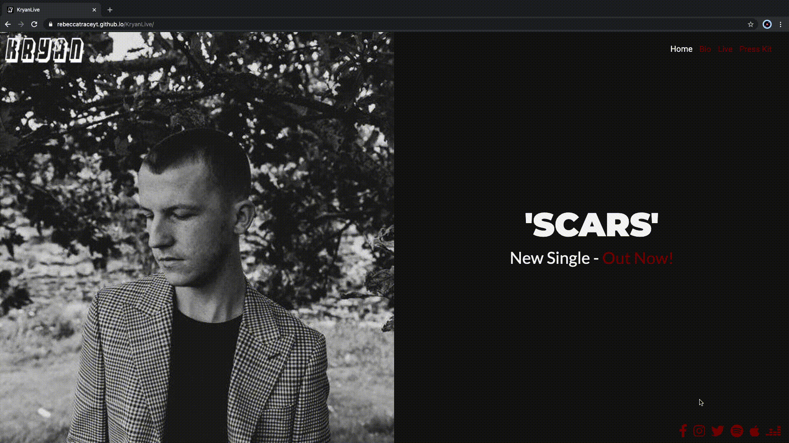
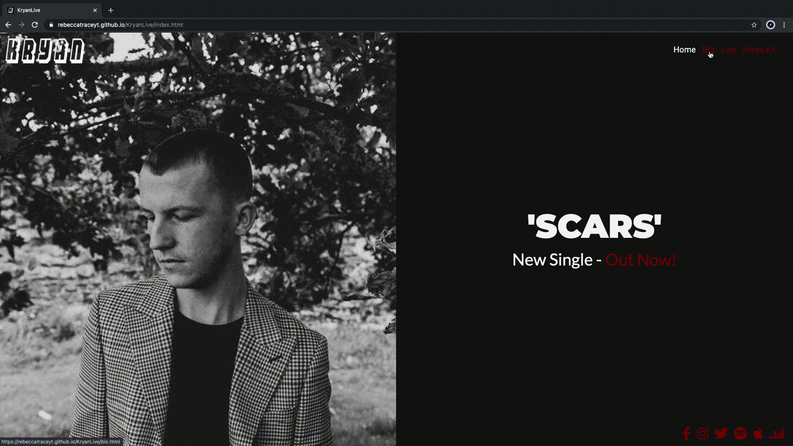
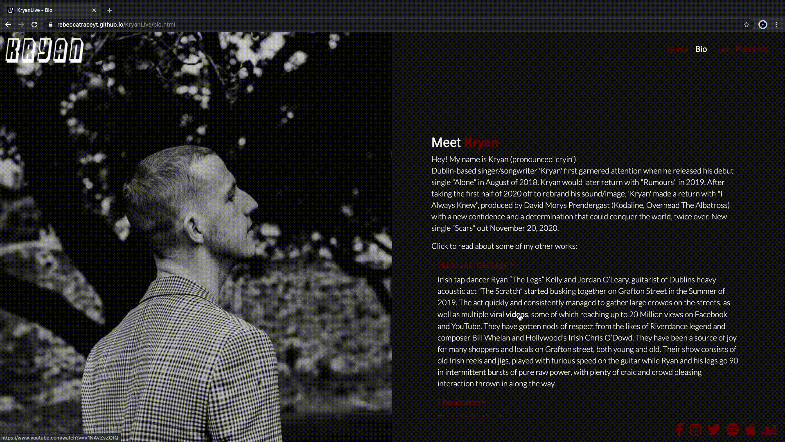
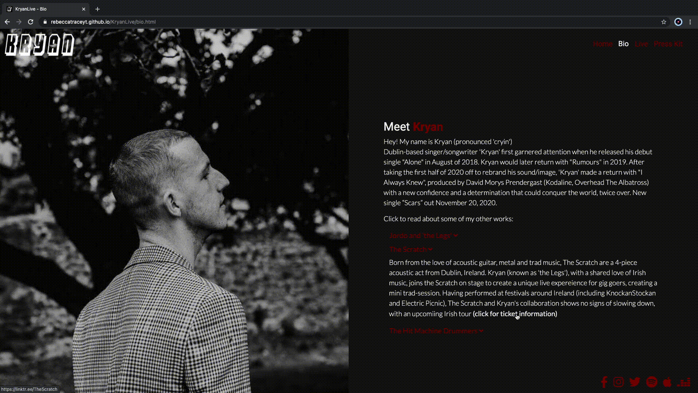
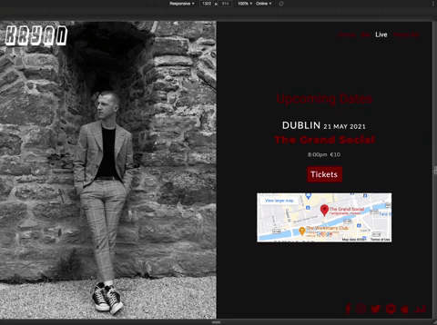
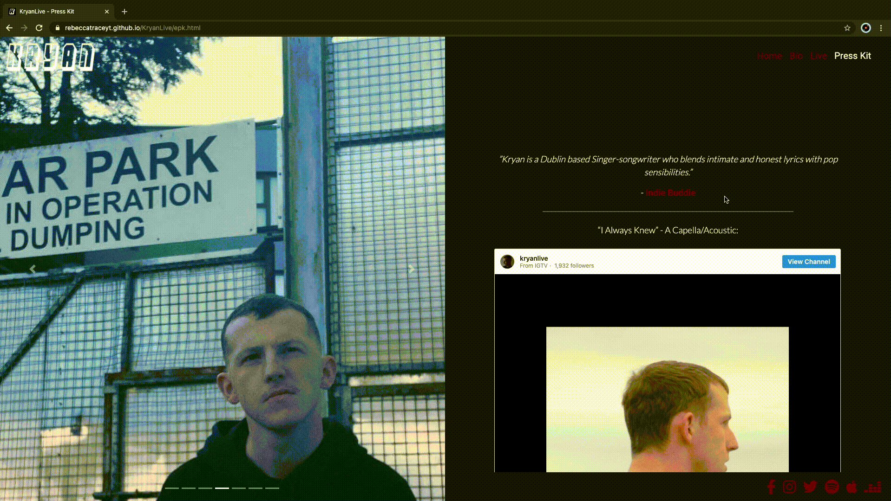

# Kryan Live - Testing 

[Main README.md file](/README.md)

[View live project](https://rebeccatraceyt.github.io/KryanLive/)

[View website in GitHub Pages](https://github.com/rebeccatraceyt/KryanLive)

***
## Table of contents
1. [Testing User Stories](#Testing-User-Stories)
2. [Manual Testing](#Manual-Testing)
3. [Automated Testing](#Automated-Testing) 
     - [Code Validation](#Code-Validation)
     - [Browser Validation](#Browser-Validation)
     - [Lighthouse Auditing](#Lighthouse-Auditing)
4. [User Testing](#User-Testing)

***

## Testing User Stories

#### New/Potential Fans Goals:
1. As a new fan, I want to easily navigate through the website to find the relevant content, effortlessly.

     - The navigation bar is clearly defined and easily navigable for users to find and use.
     - The logo image on the top left of each page leads users back to the home page.
     - The footer menu is easy to use with appropriate icons for easy identification.

2. As a new fan, I want to learn more about the artist's background in order to better understand Kryan and their music.

     - The 'Bio' page is appropriately named for users wishing to find out about Kryan.
     - The 'Bio' page is easily found on each page, no matter the device. 
     - Clicking on each of the collaborations will open an accordion menu for users to learn more.

3. As a new fan, I want to easily navigate to the artist's social links in order to keep up with the latest news and releases.

     - The social links are located in the footer on desktop and tablet devices.
     - On mobile devices, the socials are located within the header menu (illustrated with the toggler button).
     - In each instance, each link is represented by an appropriate icon for easy identification of the social platform.

4. As a new fan, I want to easily find links to the hosted music platform of my choice, in order to listen to Kryan.

     - The music platform links are included in the social links menu - this was in order to promote the links as another point of contact for new fans to find out about Kryan.
     - The music platforms represented are ones that are most popular.

5. As a new fan, I want to be able to watch an embedded video to be able to get a snapshot of Kryan performing.

     - The press kit page is for both business and casual enquirers, providing a easy navigable page where users can find snapshots (including videos) of Kryan and his sound.

#### Current Fans Goals:
1. As a current fan, I want to navigate to information about upcoming live events in order to securely order tickets.

     - The 'Live' page is appropriately named for users to go straight to the information they seek.
     - On the Live page are multiple points of interest and actions, including a "Tickets" button providing a link to the external ticketing site.

2. As a current fan, I want to find out about new and upcoming releases to be able to pre-save or listen to the music.

     - The Home Page was designed to host the latest and upcoming releases as this is most common story amongst users.

3. As a current fan, I want to easily navigate to the artist's music page on my desired music platform, e.g. Spotify.

     - The music platform links are included in the social links menu.
     - The platforms selected are the three that are favourites of current users.
     - The Press Kit page also hosts a Spotify embed as this is the most popular music platform that Kryan fans use.

#### Potential Bookers Goals:
1. As a potential booker, I want to easily navigate to the artist's Electronic Press Kit to source relevant information.

     - The 'Press Kit' page is appropriately named for users to easily navigate to the page, regardless of what page they are on.
     - The page is optimized for users to easily find the information they desire, as each section is clearly defined within the Press Kit.

#### Media Enquirer Goals:
1. A a media enquirer, I want to easily navigate to the artist's Electronic Press Kit to source relevant information.

     - The 'Press Kit' page is appropriately named for users to easily navigate to the page, regardless of what page they are on.
     - The page is optimized for users to easily find the information they desire, as each section is clearly defined within the Press Kit.

2. As a media enquirer, I want to easily find materials that could be useful for media coverage pieces.

     - Each page has highlighted features that is potential material for media enquirers.
     - The most commonly searched features are emphasized in order to draw the users directly to that information.

[Back to top ⇧](#Kryan-Live---Testing)

## Manual Testing

### Common Elements Testing
Manual testing was conducted on the following elements that appear on every page:

- Hovering over the Navbar will trigger `hover` effect, confirming the link the users are on

     

- Hovering over Social links will trigger `hover` effect and clicking on them will open a new tab

     

     

     

     

     

     

### Home Page
Manual testing was conducted on the following elements of the [Home Page](index.html):

- Clicking logo on left of screen will refresh the landing page

     

- Hovering over 'Out Now' link will create a `hover` effect

     

- On a mobile device, the hero image stacks on top of the other column for UX purposes

     

- The responsiveness of the Home page

     

### Bio Page
Manual testing was conducted on the following elements of the [Bio Page](bio.html):

- Clicking the logo on the top left of the page will return the user to the Home Page

     

- Hovering over each of the accordion menu links will trigger the `hover` effect
      
     

- Clicking the links in each accordion menu link will open a new tab
 
     

     

     

- On a mobile device, the hero image stacks on top of the other column for UX purposes

     

- The responsiveness of the Bio page

     

### Live Page
Manual testing was conducted on the following elements of the [Live Page](live.html):

- Clicking the logo on the top left of the page will return the user to the Home page

     

- Hovering over the venue name will trigger a `hover` effect and clicking it will open the event page in a new tab

     

- Hovering over the ticket button will trigger a `hover` effect and clicking will open ticketing site in a new tab   

     

- Clicking on the map `iframe` embed will open the map in a new tab

     

- On a mobile device, the hero image stacks on top of the other column for UX purposes

     

- The responsiveness of the Live page

     

### Press Kit Page
Manual testing was conducted on the following elements of the [Electronic Press Kit Page](epk.html):

- Clicking the logo on the top left of the page will return the user to the Home page

     

- Clicking the `next tab` icon on the carousel will allow the user to flick through the images

     

- Hovering over the article link will trigger a `hover` effect and clicking will open article in a new tab

     

- Clicking on the IGTV `iframe` embed will open the video in a new tab

     

- Clicking on the Spotify `iframe` will allow the users to control the music playing in the embed

     

- When filling out the contact form, the user must complete all fields

     

- On a mobile device, the hero image stacks on top of the other column for UX purposes

     

- The responsiveness of the Electronic Press Kit page

     

[Back to top ⇧](#Kryan-Live---Testing)

## Automated Testing

### Code Validation
The [W3C Markup Validator](https://validator.w3.org/) service was used to validate the `HTML` code used.

**Results:**

- Home Page

     

- Bio Page

     

- Live Page

     

- Electronic Press Kit Page

     

The [W3C CSS Validator](https://jigsaw.w3.org/css-validator/) service was used to validate the `CSS` coded used.

**Results:**

### Browser Validation
- Chrome - [test image](assets/testing-files/automated/chrome.png)
- Safari - [test image](assets/testing-files/automated/safari.png)
- Edge - [test image](assets/testing-files/automated/edge.png)
- Opera - [test image](assets/testing-files/automated/opera.png)
- Firefox - [test image](assets/testing-files/automated/firefox.png)

### Lighthouse Auditing
- Click [here](assets/testing-files/automated/lighthouse.pdf) for full report
- No recommendations in this report have been implemented in the first release but will be looked into for future releases.

[Back to top ⇧](#Kryan-Live---Testing)

## User testing 
Friends and family members were asked to review the site and documentation to point out any bugs and/or user experience issues. Their helpful advice throughout the process led to many UX changes in order to create a better experience. 

It was through this testing that the following changes were made:
- Change to the Navbar background color on mobiles in order for the toggler menu icon to more distinguishable to the background image.
- Change to Navbar font-size on mobile for clearer reading.
- Complete overhaul of Live page in order to display the information in a more user-friendly way.

[Back to top ⇧](#Kryan-Live---Testing)

***